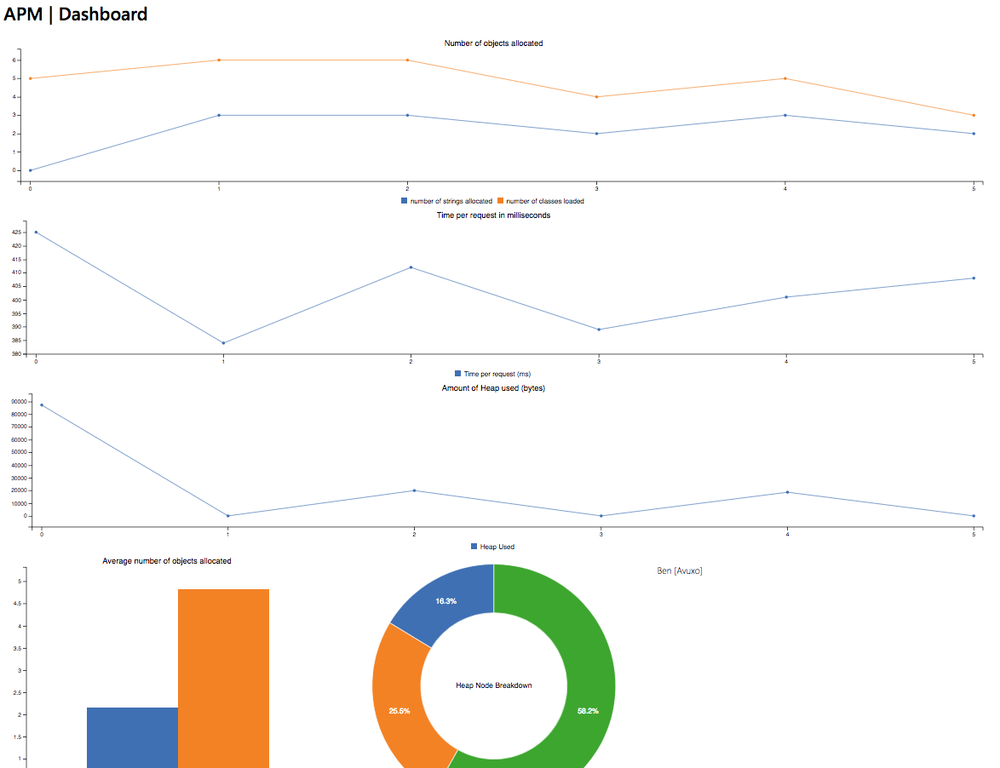

# APM

Language Agent for Express and Node.js.
[](https://travis-ci.com/Avuxo/APM)


## Purpose

When writing modern Express applications for a large userbase, it's important to see much of your server's limited resources are being used by your app. As such, tools like APM provide an interface to see deep into what your application is doing. Is it allocating too many objects? Are too many strings being allocated? By looking at the numbers and modifying your code, you can check for changes in speed and performance. Through the Express middleware, one can also quickly check and compare the time to complete requests to your web application.

## Usage

The APM dashboard provides a wide variety of information in one simple view. All of the information being returned from the Node.js Language agent gets parsed into a format that's simple to read at a glance. Although the dashboard is not a requirement for usage with (or without) Express, it is recommended.



To embed in Express and view the analytics in a browser, simply use the provided middleware:

```js
const app = require('express')();
const apm = require('express-apm');

// local server on port 8080
const server = new apm.server(8080);

// use the event emitter from the `server' object.
// make sure to load this middleware first so it can check the entire request.
// express-apm will capture requests and record metrics.
app.use(apm(server.emitter));

// your express code
```
When using APM with Express, the front-end graphs will update every 3 seconds (assuming there is a change), and will pull the most recent successful request. All previous requests will be loaded when you open the dashboard for the first time. To load all previous requests (including those missde during the 3 second intervals), refresh the page.

The REST endpoint `/metrics` on the APM port will allow you to get the most recent request without the use of the dashboard; the `/fullMetrics` endpoint provides every previous request.

Each request returns an object in the format:
```
{
        id: Number, // the unique ID of the request
        memoryUsed: Number, // the amount of memory used (in killobytes) during the request
        numClasses: Number, // the number of classes loaded during the request
        numNodes: Number, // the number of Heap Nodes (total) during the request
        numStrings: Number, // the number of strings loaded during the request
        time: 375 // the amount of time (in ms) spent during the request
}
```
When the `/fullMetrics` endpoint is used, the array of objects is wrapped in an object with the key `data` linking to the array.

Or without the use of the built in express server:

```js
const app = require('express')();
const apm = require('express-apm');

// setup the Express middleware.
// load this middleware first
// pass `null' when you don't want use the local express-apm analytics server.
app.use(apm(null));
```

APM can be used outside of Express as well. In order to use outside of your webapp, simply use the exported `Heap` class. First, instantiate the `Heap` class, and when you're done call `Heap.stop();`

```js
const apm = require('express-apm');

// start heap check
var startHeap = new apm.Heap();

// do stuff

var finishHeap = startHeap.stop(); // finish heap check and diff the two
console.log(finishHeap);
```

When not using the express middleware, time checks are not performed. This can easily be implemented with a number of timing packages or through the use of the Javascript `Date.now()` functionality.

Furthermore, heap size checks are not performed, but this can also be accessed natively in Node.js. Use the `process.memoryUsage()` function to get this information.

### Usage Example: [Contrast NodeTestBench](https://github.com/Contrast-Security-OSS/NodeTestBench)

Here is a real world example of setting up APM on an existing web app.

1. Clone the repo: `$ git clone https://github.com/Contrast-Security-OSS/NodeTestBench.git`.

2. Enter the directory and install the dependencies. `$ cd NodeTestBench; npm i`.

3. Install `express-apm`: `$ npm i express-apm`.

4. Add the APM code into the existing codebase.

   i) open `index.js` in the NodeTestBench directory and add `const apm = require('express-apm');` on line 10.
   
   ii) on the next line, add `const apmServer = new apm.server(8080);` to create an APM local server.

   iii) Finally, on line 15, add `app.use(apm(apmServer.emitter));` to instantiate the event listener.

The final result should look roughly like:
```js
const http = require('http');
const https = require('https');
const pem = require('pem');
const apm = require('express-apm');
const apmServer = new apm.server(8080); // start APM on port 8080

require('./vulnerabilities/static');

const app = express();

app.use(apm(apmServer.emitter)); // MAKE SURE APM is loaded FIRST.
app.use('/assets', express.static('public'));
```

Simply start the server with `$ node index.js` from the root directory of the project.

If you now run `$ curl localhost:3000; curl localhost:8080/metrics` in another terminal, you should see a stream of HTML (for the curl call to 3000) and then a REST printout of the most recent request's metrics.


## Setup

1. Prerequisites: GNU Make, Python, and a c++ compiler (tested with g++ and clang++)

2. Install `node-gyp`: the Node native build tool. You can run `npm i node-gyp -g` to install it globally.

3. Install the `express-apm` package into your project with `$ npm i express-apm`.

Installation note: Make sure that you have a version of Python supported by node-gyp (= v2.5.0 & < 3.0.0).

Unit tests can be run with the `$ npm run test`.

Support tested for Node.js 8 and 9.
